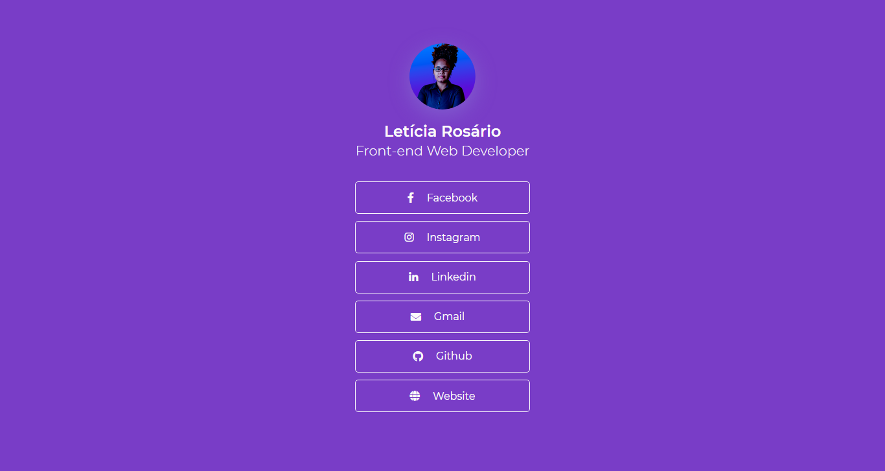

# Meu Linktree

---

# Tecnologias utlilizadas

Usei o glassmorfism a mais nova sensação do momento entre os design, mas o que é o glassmorfism dexa um fundo semitranparente e com um borda e sombra quase transparente.
